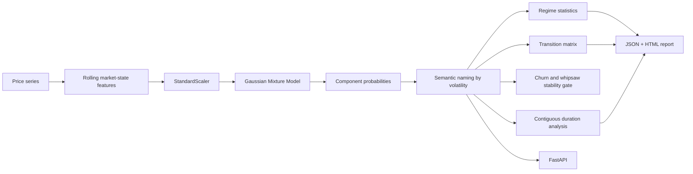

# Market Regime Detection

A runnable unsupervised market-state project using **Gaussian Mixture Models (GMMs)** over rolling return, volatility, momentum, drawdown and downside-volatility features.

The repository adds the engineering pieces around the clustering itself: deterministic synthetic ground truth, confidence scores, transition matrices, regime-duration analysis, temporal-stability release gates, API/CLI entrypoints, reports, Docker and CI.

## Architecture



## Features

- rolling mean return;
- rolling volatility;
- momentum;
- rolling drawdown;
- downside volatility.

The model is fitted after standardization. GMM component IDs are arbitrary, so the project explicitly maps components to semantic names by their average volatility:

```text
lowest volatility  -> calm
middle components  -> transition
highest volatility -> stress
```

This avoids pretending that GMM component `0` has a stable business meaning across fits.

## Synthetic validation

`regime/synthetic.py` generates piecewise calm, transition and stress periods with construction-time labels. The unsupervised predictions are compared with those labels using **Adjusted Rand Index (ARI)**.

That evaluation is useful for CI and methodology checks. Real financial markets do not provide clean objective regime labels, so the synthetic ARI is not presented as real-world accuracy.

## Transition analysis

After classifying each timestamp, the project measures empirical transitions such as:

```text
calm -> calm
calm -> transition
transition -> stress
stress -> transition
```

It also measures average contiguous duration by named regime.

Important distinction: **this is still a GMM, not an HMM**. Temporal transition probabilities are measured after clustering; they are not part of the likelihood optimized by the mixture model.

## Temporal-stability gate

A regime model can have plausible aggregate statistics while flickering between states too quickly to support a production decision. Every analysis therefore includes a fail-closed stability audit over the unsmoothed predictions:

- switch rate across consecutive observations;
- fraction of observations belonging to runs shorter than the policy minimum;
- immediate A→B→A reversal rate (default ceiling: `0.50` of eligible run triplets);
- aggregate confidence and dominant-regime share;
- run-level start/end positions, length and mean confidence;
- deterministic reason codes for every policy violation.

CI requires the synthetic reference experiment to pass the default policy:

```bash
python -m regime.cli --cycles 1 --seed 42 --require-stable
```

`--require-stable` exits `2` when the policy is rejected. Python callers can pass a `RegimeStabilityPolicy` to `RegimeExperiment.analyze` to set evidence minimums and thresholds appropriate to their decision cadence.

The audit does not smooth labels or improve model quality; it exposes unusable churn rather than hiding it. Confidence is the GMM posterior under its fitted assumptions and is not calibrated correctness probability. Thresholds must be selected on a historical validation period, then held fixed on forward data. A live trading control should additionally include costs, execution delay and point-in-time data checks.

## Quick start

```bash
python -m venv .venv
source .venv/bin/activate  # Windows: .venv\Scripts\activate
pip install -r requirements.txt
python -m regime.cli --seed 42 --regimes 3 --cycles 2
```

Artifacts:

```text
artifacts/regimes.json
artifacts/regimes.html
```

Custom CSV input:

```bash
python -m regime.cli --input market.csv
```

with:

```text
timestamp, close
```

## API

```bash
uvicorn app.api:app --reload
curl http://localhost:8000/demo
```

`POST /analyze` accepts a custom price history and number of regimes.

## Docker

```bash
docker build -t market-regime-detection .
docker run --rm -p 8000:8000 market-regime-detection
```

## Tests / CI

```bash
ruff check .
pytest -q
```

CI runs synthetic regime validation, probability-transition checks, the temporal-stability gate, a CLI experiment and container build.

## Model limitations

GMMs assume observations come from a finite mixture of parametric distributions and do not directly model state persistence. Rolling features are autocorrelated, component naming is heuristic, and real markets can transition gradually or create regimes absent from the training sample. Extensions worth comparing include HMMs, change-point detection, switching autoregressions and nonparametric clustering.

## Portfolio signal

**Python · Pandas · scikit-learn · Gaussian Mixture Models · unsupervised learning · market regimes · transition analysis · temporal stability · ARI · FastAPI · Docker · CI/CD**
